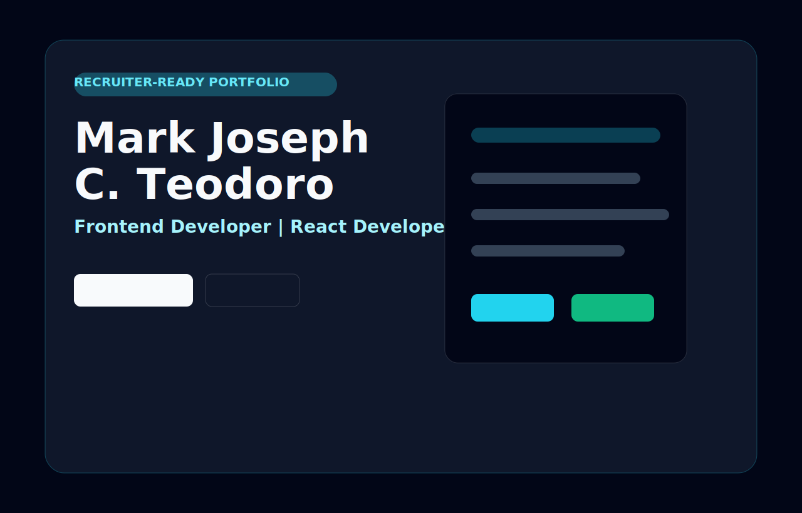
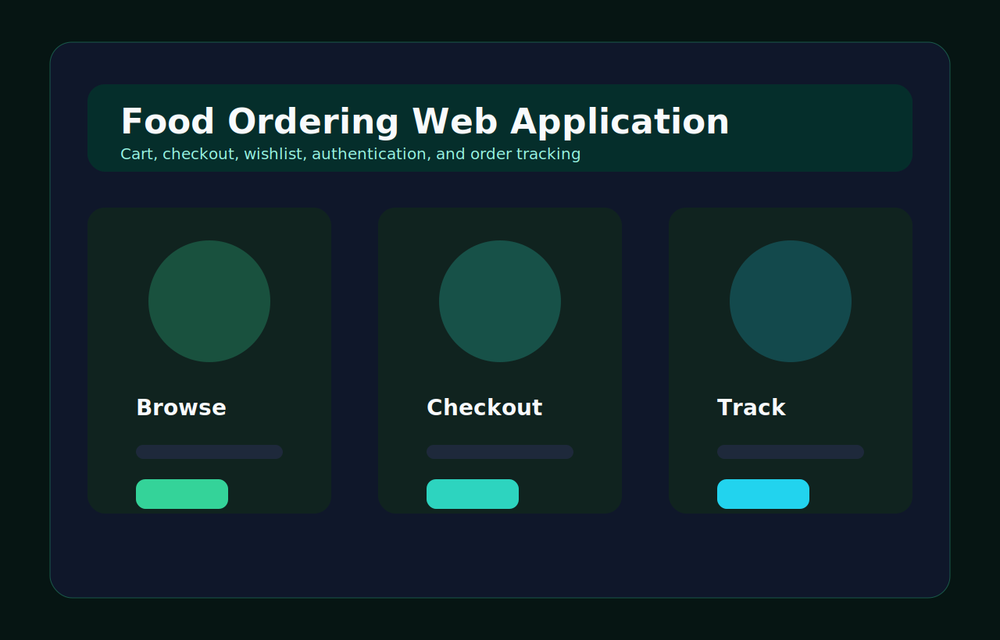

# Mark Joseph C. Teodoro Portfolio

[](https://yourname.vercel.app)
[](https://github.com/sevi07202007)
[](https://nextjs.org)

A recruiter-ready portfolio built with Next.js 15, TypeScript, Tailwind CSS v4, shadcn-style components, Framer Motion, and Lucide React.

The goal of this portfolio is to communicate within the first 5-10 seconds that I am ready for frontend, React, or full-stack developer opportunities. It highlights real-world projects, technical decisions, project challenges, solutions, and clear links to live demos and repositories.

## Features

- Strong first-screen personal brand and role positioning
- Recruiter-friendly project case studies
- Live Demo and GitHub Repository buttons for each featured project
- Responsive screenshots and visual project previews
- Typed content source for projects, skills, contact details, and process
- Reusable shadcn-style UI components
- Framer Motion animations
- Lucide React icon system
- Strict TypeScript configuration
- SEO metadata with Open Graph and Twitter card support
- Error boundary
- Tailwind CSS v4 global design tokens
- ESLint and Prettier configuration
- Vercel-ready project structure

## Tech Stack

- Framework: Next.js 15 App Router
- Language: TypeScript with strict mode
- Styling: Tailwind CSS v4
- UI: shadcn/UI-style local components
- Animation: Framer Motion
- Icons: Lucide React
- Deployment: Vercel
- Version Control: Git and GitHub
- Code Quality: ESLint and Prettier

## Screenshots

### Portfolio



### Food Ordering Project



## Featured Projects

### Library Management System

A responsive PHP and MySQL platform for managing books, student records, borrowing activity, and admin workflows.

- Live Demo: https://library-management.vercel.app
- GitHub Repository: https://github.com/sevi07202007/library-management-system
- Stack: PHP, MySQL, JavaScript, HTML, CSS, XAMPP
- Role: Database design, PHP CRUD implementation, responsive UI, workflow testing

### Food Ordering Web Application

A customer-focused food ordering experience with authentication, cart management, checkout, wishlist, and order tracking.

- Live Demo: https://food-ordering.vercel.app
- GitHub Repository: https://github.com/sevi07202007/food-ordering-system
- Stack: PHP, MySQL, Bootstrap, JavaScript, HTML, CSS
- Role: Frontend implementation, backend workflow logic, database integration, UX refinement

## Getting Started

### Prerequisites

- Node.js 20 or newer
- npm
- Git

### Installation

```bash
git clone https://github.com/sevi07202007/mark-joseph-portfolio.git
cd mark-joseph-portfolio
npm install
```

### Environment Variables

Create a `.env.local` file using `.env.example` as a reference.

```bash
NEXT_PUBLIC_SITE_URL=https://yourname.vercel.app
NEXT_PUBLIC_GITHUB_URL=https://github.com/sevi07202007
NEXT_PUBLIC_CONTACT_EMAIL=teodorojoseph60@gmail.com
```

### Development

```bash
npm run dev
```

Open `http://localhost:3000`.

### Production Build

```bash
npm run build
npm run start
```

### Code Quality

```bash
npm run lint
npm run typecheck
npm run format:check
```

## Deployment

Deploy the portfolio to Vercel:

```bash
npm install -g vercel
vercel
vercel --prod
```

Recommended production URL:

```text
https://yourname.vercel.app
```

Each featured project should also be deployed separately to Vercel and linked from the portfolio:

```text
https://library-management.vercel.app
https://food-ordering.vercel.app
```

## Repository Standards

- Use meaningful commits, for example `feat: build recruiter portfolio homepage`
- Keep project data in `data/portfolio.ts`
- Keep reusable UI in `components/ui`
- Commit a fresh `package-lock.json` after running `npm install`
- Add real screenshots when project deployments are live
- Keep README links updated after Vercel deployment

## Contact

- Email: teodorojoseph60@gmail.com
- Phone: 0950-059-0093
- Location: Rizal, Philippines
- GitHub: https://github.com/sevi07202007

## License

This project is licensed under the MIT License.
